  

&nbsp;
&nbsp;
&nbsp;

 

> **Most of what I build runs on a server. Some of it runs on a street.**
>
> Full-stack engineer and founder. I ship production software and a published developer tool — and I build the systems behind modular solar infrastructure for urban India.

 

## Now

**SolarNexa** — Founder. Modular solar trees with integrated EV charging for urban India. Leading product and engineering.

**AdMesh** — AI Fellow. Building *Adplex*, an AI-native ad decision engine — prompt architecture and product systems.

## Previously

**GitHub Community GITAM** — President. Led a 28-member team and ran *Epoch* Tech Fest for 5,000+ attendees. Took the community to a Best Technical Club award.

**99 Yards** *(New York · Remote)* — Software Engineer Intern. Shipped mobile prototypes and ran design-sprint reviews for a fashion-tech platform.

 

## Selected work

<table>
<tr>
<td width="50%" valign="top">

**[vazr](https://www.npmjs.com/package/@lechakrawarthy/vazr)**

Cross-platform disk-cleanup CLI — independently published and in active use.

`Node.js`&nbsp;·&nbsp;`CLI`

</td>
<td width="50%" valign="top">

**DDoS Detection**

LSTM model for network-threat detection. **99.73%** accuracy, **0.9958** MCC on benchmark traffic.

`TensorFlow`&nbsp;·&nbsp;`Deep Learning`

</td>
</tr>
<tr>
<td width="50%" valign="top">

**Epoch Platform**

Full-stack hackathon operations — QR issue submission, live dashboards, role-based auth. Ran for **278+ teams**.

`Next.js`&nbsp;·&nbsp;`Supabase`&nbsp;·&nbsp;`JWT`

</td>
<td width="50%" valign="top">

**Twinance**

Personal-finance platform with analytics dashboards, realtime sync, and JWT-secured REST APIs.

`React`&nbsp;·&nbsp;`Node`&nbsp;·&nbsp;`PostgreSQL`

</td>
</tr>
</table>

→ more at **[github.com/lechakrawarthy](https://github.com/lechakrawarthy)**

 

## Stack

  

## GitHub

<!-- Metrics infographic — generated daily by .github/workflows/metrics.yml -->

 

  

  

<!-- Lines-of-code by language — sign in at githubtrends.io to get your embed id -->

 

### Weekly coding breakdown

<!--START_SECTION:waka-->
<!-- Auto-filled by .github/workflows/waka-readme.yml once WakaTime has data -->
<!--END_SECTION:waka-->

 

---

Looking for software engineering internships — and good problems to work on.

&nbsp;

