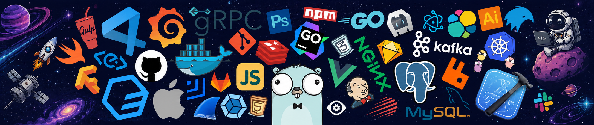
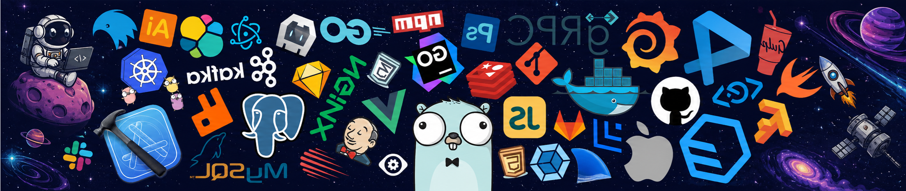

<div align="center">


<br/><br/>

<h2>hey, i'm chakrawarthy &nbsp;</h2>

[](https://git.io/typing-svg)

<br/>

[](https://linkedin.com/in/lechakrawarthy)
[](https://lechakrawarthy18.vercel.app/)
[](https://www.npmjs.com/~lechakrawarthy)
[](mailto:chakravarthi1597@gmail.com)

</div>


<br/>

> **most of what i build runs on a server. some of it runs on a street.**
>
> i'm a full-stack engineer and founder who ships real software — a published cli tool with real users, platforms that ran for thousands of people, and infrastructure for solar-powered urban india. i don't just build for portfolios.


<h3>&nbsp; now</h3>

- ⚡ **founder, [solarnexa](https://solarnexa.vercel.app)** — building solar-powered urban infrastructure for india · cleantech · est. 2023

<br/>

<h3>&nbsp; previously</h3>

- 🧠 **ai fellow, [admesh](https://admesh.co)** — built adplex, an ai-native ad decision engine · prompt architecture · product systems · remote
- 💼 **swe intern, 99 yards** — new york (remote) · fashion-tech platform · design sprints · mobile prototypes
- 👥 **president, [github community gitam](https://github.com/GitHub-Community-GITAM)** — 28-member team · epoch tech fest · 5000+ attendees · best technical club award


<h3>&nbsp; shipped</h3>

<table>
<tr>
<td width="50%" valign="top">

📦 **[vazr](https://github.com/lechakrawarthy/vazr)** — cli disk cleanup · [`@lechakrawarthy/vazr`](https://www.npmjs.com/package/@lechakrawarthy/vazr)

<a href="https://www.npmjs.com/package/@lechakrawarthy/vazr"></a>


<sub>`Node.js` · `CLI`</sub>

</td>
<td width="50%" valign="top">

🛡️ **ddos detection** — lstm classifier · **99.73% acc** · mcc 0.9958

<sub>`TensorFlow` · `Deep Learning`</sub>

</td>
</tr>
<tr>
<td width="50%" valign="top">

🎫 **[hackathon issue management platform](https://sihsupport.vercel.app)** — built for epoch 4.0 · qr-based issue submission · live dashboards · role-based auth · **278+ teams, 1600+ participants**

<sub>`Next.js` · `Supabase` · `JWT`</sub>

</td>
<td width="50%" valign="top">

💰 **[twinance](https://twinance.vercel.app)** — personal finance platform · analytics dashboards · realtime sync · jwt rest apis

<sub>`React` · `Node.js` · `PostgreSQL`</sub>

</td>
</tr>
<tr>
<td width="50%" valign="top">

🔗 **coinnect** — gamified blockchain lms · real-time crypto simulator · green coin rewards

<sub>`Next.js` · `MongoDB` · `NextAuth.js`</sub>

</td>
<td width="50%" valign="top">

📊 **traffic severity** — ml pipeline on uk stats19 · ieee → icac2n

<sub>`Python` · `scikit-learn`</sub>

</td>
</tr>
</table>


<h3>🏆&nbsp; achievements</h3>

- 🔥 **cognizant technoverse 2026** — top 1,000 nationally · 4,000+ teams · 400+ colleges · only team from gitam shortlisted
- 💎 **smart india hackathon 2025** — top 35 team · *mula* blockchain project
- ⭐ **best technical club award** — github community gitam


<h3>&nbsp; stack</h3>

<table>
<tr>
<td align="right" width="80"><sub><b>frontend</b></sub></td>
<td></td>
</tr>
<tr>
<td align="right"><sub><b>backend</b></sub></td>
<td></td>
</tr>
<tr>
<td align="right"><sub><b>ai / ml</b></sub></td>
<td></td>
</tr>
<tr>
<td align="right"><sub><b>infra</b></sub></td>
<td></td>
</tr>
<tr>
<td align="right"><sub><b>tools</b></sub></td>
<td></td>
</tr>
</table>

<br/>

<h3>⌚&nbsp; coding time</h3>

<!--START_SECTION:waka-->


**🐱 My GitHub Data** 

> 📦 ? Used in GitHub's Storage 
 > 
> 🏆 589 Contributions in the Year 2026
 > 
> 🚫 Not Opted to Hire
 > 
> 📜 20 Public Repositories 
 > 
> 🔑 0 Private Repositories 
 > 
**I'm a Night 🦉** 

```text
🌞 Morning                1742 commits        █████░░░░░░░░░░░░░░░░░░░░   20.45 % 
🌆 Daytime                1784 commits        █████░░░░░░░░░░░░░░░░░░░░   20.95 % 
🌃 Evening                3508 commits        ██████████░░░░░░░░░░░░░░░   41.19 % 
🌙 Night                  1483 commits        ████░░░░░░░░░░░░░░░░░░░░░   17.41 % 
```
📅 **I'm Most Productive on Monday** 

```text
Monday                   1422 commits        ████░░░░░░░░░░░░░░░░░░░░░   16.70 % 
Tuesday                  1391 commits        ████░░░░░░░░░░░░░░░░░░░░░   16.33 % 
Wednesday                1407 commits        ████░░░░░░░░░░░░░░░░░░░░░   16.52 % 
Thursday                 1075 commits        ███░░░░░░░░░░░░░░░░░░░░░░   12.62 % 
Friday                   1281 commits        ████░░░░░░░░░░░░░░░░░░░░░   15.04 % 
Saturday                 690 commits         ██░░░░░░░░░░░░░░░░░░░░░░░   08.10 % 
Sunday                   1251 commits        ████░░░░░░░░░░░░░░░░░░░░░   14.69 % 
```


📊 **This Week I Spent My Time On** 

```text
💬 Programming Languages: 
TypeScript               10 hrs 18 mins      █████████████████░░░░░░░░   66.96 % 
Other                    1 hr 42 mins        ███░░░░░░░░░░░░░░░░░░░░░░   11.14 % 
Markdown                 1 hr 1 min          ██░░░░░░░░░░░░░░░░░░░░░░░   06.70 % 
JSON                     50 mins             █░░░░░░░░░░░░░░░░░░░░░░░░   05.48 % 
CSS                      35 mins             █░░░░░░░░░░░░░░░░░░░░░░░░   03.85 % 
```

**I Mostly Code in TypeScript** 

```text
TypeScript               46 repos            ████████████░░░░░░░░░░░░░   50.00 % 
Python                   20 repos            █████░░░░░░░░░░░░░░░░░░░░   21.74 % 
JavaScript               14 repos            ████░░░░░░░░░░░░░░░░░░░░░   15.22 % 
HTML                     4 repos             █░░░░░░░░░░░░░░░░░░░░░░░░   04.35 % 
CSS                      2 repos             █░░░░░░░░░░░░░░░░░░░░░░░░   02.17 % 
```


**Timeline**


 Last Updated on 13/06/2026 04:26:15 UTC
<!--END_SECTION:waka-->

<br/>

<h3>&nbsp; github</h3>

<div align="center">


<br/>


<br/>


<br/><br/>

<picture>
  <source media="(prefers-color-scheme: dark)" srcset="https://raw.githubusercontent.com/lechakrawarthy/lechakrawarthy/output/github-snake-dark.svg"/>
  <source media="(prefers-color-scheme: light)" srcset="https://raw.githubusercontent.com/lechakrawarthy/lechakrawarthy/output/github-snake.svg"/>
  
</picture>

</div>

<br/>


<br/>

> **if you've read this far — let's build something that matters.**

<br/>

<div align="center">

*"After all this time?"*

*"Always."*

</div>

<br/>


